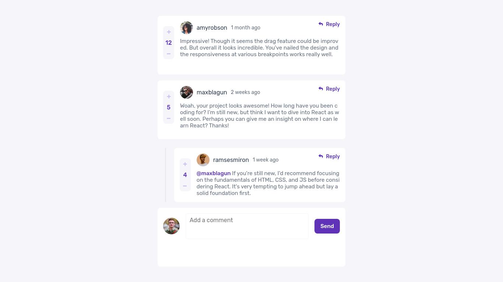
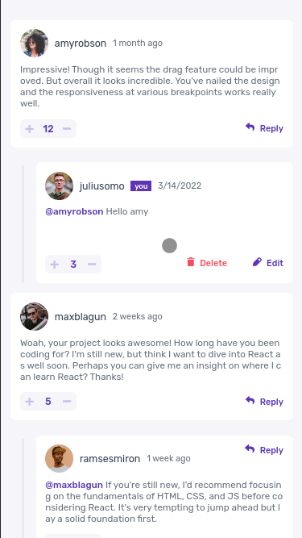

# README

<h1 align="center">Interactive Comments Section</h1>

<h1></h1>
<h1></h1>
<h1 align="center"></h1>

> Status: Production ✅

## ❔ About

It's a project created with React library, and the project it's a interactive section comments at that the user add one comment, reply other comments, update your comment and exclude your comment, we call it CRUD (Create, Read, Update, Delete).

The layout was developed by [Frontend&nbsp;Mentor](https://www.frontendmentor.io/home)

All components and elements, was styled with Styled-components, a css-in-js library.
### API

I developed one API-rest with [Node.js](https://www.nodejs.org), [Express](https://www.expressjs.com), [MongoDB](https://mongodb.org) and one ODM [Mongoose](https://mongoosejs.com)

##
## 📝 Pre-requisites

- Install the [Node.js](https://www.nodejs.org) on your machine

- Have git installed on your machine [Git](https://git-scm.com)

##

## 🚀 Run the project

```bash
# Clone the project from Github
git clone https://github.com/DanteBenicio/interactive-comments-section-react

# Access the project folder
cd interactive-comments-section-react

# Install the project dependencies
yarn
or
npm install

# Run the project (port 3000 - http://localhost:3000)
yarn dev
or
npm run dev
```

## ✨ Tecnologies

Developed with:

- Typescript
- React
- Styled-components
- Context-API